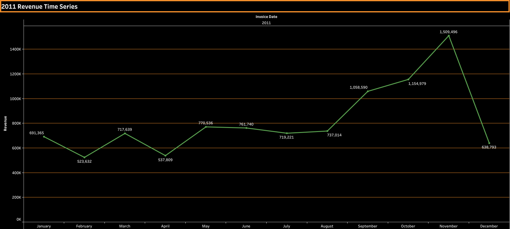
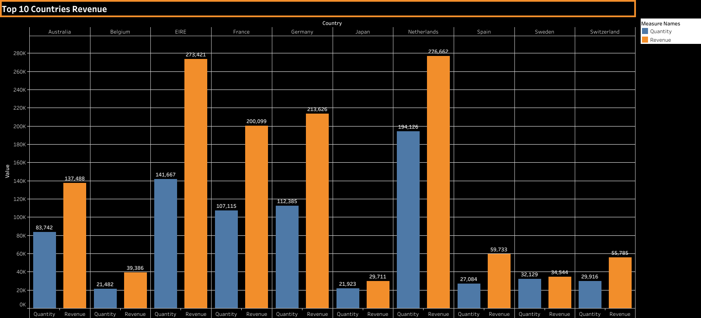
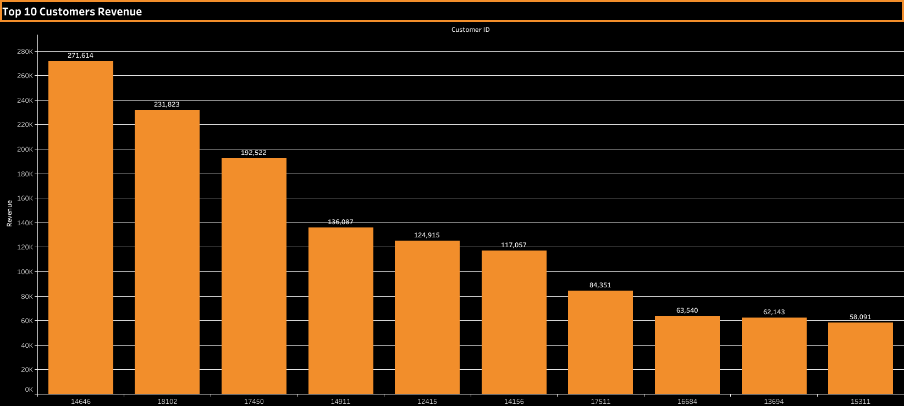
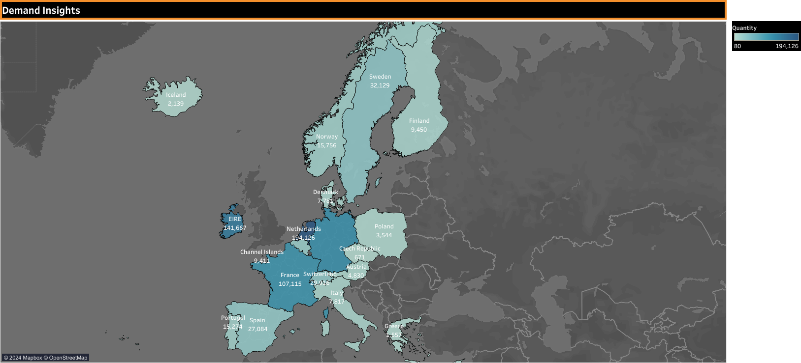
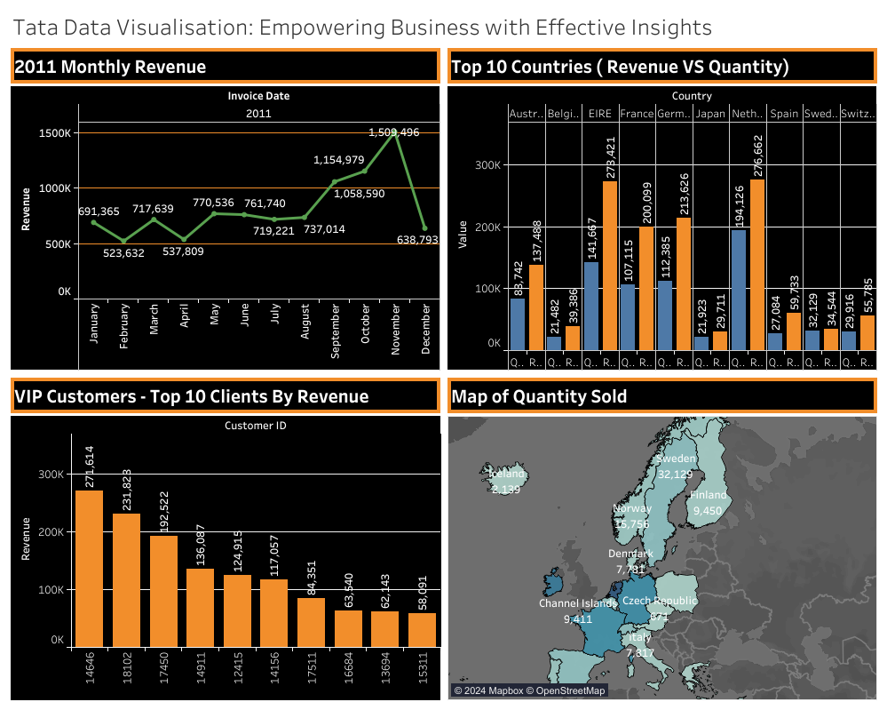

# Tata-Data-Visualisation

Gain insights into leveraging data visualisations as a tool for making informed business decisions.

# Tata Data Visualization Project

## Project Overview

This project involves analyzing data for an online retail store to provide insights for strategic planning. The analysis covers revenue trends, top-performing countries and customers, and demand insights.

## Project Structure

- `image/`: Directory for storing project images.
- `dataset/`: Directory for storing project datasets.


## Getting Started

1. **Clone the Repository:**
   ```bash
   git clone https://github.com/AyazRao/Tata-Data-Visualisation.git
   cd Tata-Data-Visualisation

## Task 1: Framing the Business Scenario
### Questions for CEO:
1. **Regional Revenue Breakdown:** Which region generates the highest and lowest revenue, aiding strategic focus?
2. **Monthly Revenue Trends:** What is the monthly revenue trend, highlighting peaks and troughs for proactive planning?
3. **Seasonal Sales Analysis:** Which months drive the most revenue? Is there a seasonal pattern influencing sales?
4. **Customer Revenue Contribution:** Who are the top customers, and how much do they contribute? Is customer base diversified?

### Questions for CMO:
5. **Repeat Customer Behavior:** What percentage of customers reorder, and do they choose the same products?
6. **Order Frequency Analysis:** How long do repeat customers take to place the next order after receiving the previous one?
7. **Revenue from Repeat Customers:** What revenue is generated from customers who order more than once?
8. **Top Repeat Customers:** Who are the customers repeating the most, and how much do they contribute to revenue?

## Task 2: Choosing the Right Visuals
- Followed the data visualization guidelines and selected appropriate visuals for each scenario.

## Task 3: Creating Effective Visuals
- Utilized Tableau to create visuals for:
  - Time series of 2011 revenue
    
  - Top 10 countries generating the highest revenue
    
  - Top 10 customers by revenue, showing gradual decline
    
  - Demand insights across countries, excluding the UK
    

  - Dashboard
    

[Tableau Project Link](https://public.tableau.com/app/profile/muhammad.ayaz.rao/viz/TATA_17044053311700/Sheet4#1)

## Task 4: Communicating Insights and Analysis
- Presented findings with clarity, addressing CEO and CMO concerns.
- Emphasized seasonality impact on revenue, opportunities in top countries, customer base strength, and expansion potential in non-European regions.

# Project Completion
- Executed tasks with a focus on effective data analysis, visualization, and strategic insights.

Feel free to reach out for any additional information or clarification.
